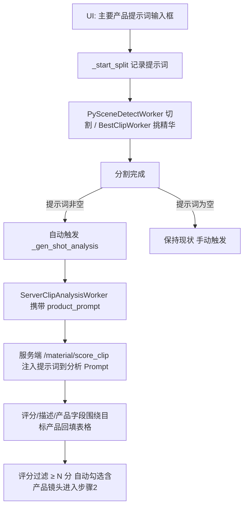

# 智能分割「主要产品提示词」功能修改方案

> 需求：智能分割时提供一个输入框填写「主要产品提示词」，AI 根据产品提示词对镜头进行精确的分割/分析。
>
> 版本分支：V1.0.7.22　|　日期：2026-08-10

---

## 一、需求背景

当前「智能混剪 → 步骤 1·镜头智能分割」流程：

1. `PySceneDetectWorker`（本地 PySceneDetect，按画面内容变化检测切点）做物理切割；
2. 无法分割的视频由 `BestClipWorker` 挑取精华片段；
3. 用户点击「生成镜头分析」后，`ServerClipAnalysisWorker` 逐条上传镜头到服务端 `POST /material/score_clip`（`analyze_shot=true&product_mode=true`），返回评分、画面描述、景别、产品、型号等字段回填表格。

**问题**：整个流程中 AI 并不知道"用户关心的主要产品是什么"，产品识别和评分是泛化的，无法围绕指定产品做精确聚焦。

**目标**：新增一个「主要产品提示词」输入框，将该提示词随镜头分析请求传给服务端，使 AI 分析围绕指定产品进行：

- 含目标产品的镜头 → 描述聚焦该产品、相关性评分提升；
- 不含目标产品的镜头 → 评分降低（可被「评分过滤 ≥ N 分」自然过滤掉）；
- 提示词为空 → 完全保持现有行为（向后兼容）。

---

## 二、现状分析

### 2.1 涉及文件

| 文件 | 职责 |
|------|------|
| `studio/gui/montage/step1_split_view.py` | 步骤 1 界面布局（`Step1SplitView`），控件均挂在 `main_page` 上 |
| `studio/gui/video_montage_page.py` | 主页面逻辑：`_start_split`（约 L2428）、`_process_next_merged_video`（约 L2520）、`_gen_shot_analysis`（约 L4488） |
| `studio/gui/montage/workers/split_workers.py` | `PySceneDetectWorker`（本地切割）、`BestClipWorker`（挑精华）、`ServerClipAnalysisWorker`（服务端镜头分析，L260+） |
| `docs/SERVER_API.md` §1.2 | 服务端 `/material/score_clip` 接口文档 |

### 2.2 关键约束

- **客户端-服务端分离架构**：AI 推理统一由算力服务端执行；客户端不得自行定义接口路径（见 SERVER_API.md 开头原则）。
- **镜头切点检测是纯算法的**（PySceneDetect 内容差异检测），产品提示词无法改变"在哪里切"；提示词作用点在**切割后的 AI 镜头分析环节**——通过评分与描述实现"围绕产品的精确筛选"。这是本方案的技术定性，需在界面上向用户说明。
- `ServerClipAnalysisWorker._analyze_one` 当前提交参数为 `data={"analyze_shot": "true", "product_mode": "true"}`，需要扩展携带 `product_prompt`。

---

## 三、总体方案



核心思路：**提示词不改变切割算法，而是贯穿到 AI 镜头分析环节**，让服务端大模型以"该产品是否出现、是否为主体"作为评分与描述的核心依据，配合现有评分过滤机制达成"精确分割出产品镜头"的效果。

---

## 四、详细修改点

### 4.1 UI 层：`studio/gui/montage/step1_split_view.py`

在「分割参数行」（`split_row`，分割阈值/最少帧数/精华时长所在行）**之前新增一行**：

```python
# 主要产品提示词
row_prompt = QHBoxLayout()
row_prompt.addWidget(QLabel("主要产品提示词:"))
self.main_page.product_prompt_input = QLineEdit()
self.main_page.product_prompt_input.setPlaceholderText(
    "选填，如：无线蓝牙耳机。填写后 AI 分析将围绕该产品精确评分与描述")
self.main_page.product_prompt_input.setToolTip(
    "填写主要产品名称/关键词后：\n"
    "· 分割完成会自动调用镜头分析；\n"
    "· AI 会为包含该产品的镜头给出更高评分与聚焦描述；\n"
    "· 留空则保持原有通用分析行为。")
row_prompt.addWidget(self.main_page.product_prompt_input)
btn_clear = QPushButton("清空")
btn_clear.setObjectName("secondary_button")
btn_clear.clicked.connect(self.main_page.product_prompt_input.clear)
row_prompt.addWidget(btn_clear)
card_layout.addLayout(row_prompt)
```

要点：
- 控件命名统一挂 `self.main_page`，与现有风格一致；
- 提示词**选填**，不阻断原有流程；
- 「清空」按钮为可选增强，低成本。

### 4.2 页面逻辑：`studio/gui/video_montage_page.py`

1. **新增辅助方法** `_get_product_prompt()`：
   ```python
   def _get_product_prompt(self):
       """读取步骤1的主要产品提示词（去首尾空白）。"""
       inp = getattr(self, "product_prompt_input", None)
       return (inp.text().strip() if inp else "")
   ```

2. **`_start_split`**：
   - 读取提示词并存为批次级状态 `self._split_product_prompt = self._get_product_prompt()`；
   - 确认对话框（`QMessageBox.question`）中追加一行提示：填写了提示词时显示 `· AI 镜头分析将围绕产品「xxx」进行精确评分`；
   - 记录到日志 `log.info`。

3. **`_on_merged_all_finished`**（全部视频处理完成）：
   - 若 `self._split_product_prompt` 非空且表格已有镜头，**自动触发** `self._gen_shot_analysis()`（当前该方法已包含无镜头/未配置服务端等保护逻辑），实现"填了提示词 → 分割 + 分析一条龙"；
   - 状态栏提示 `stage_label` 体现"正在按产品提示词分析…"。

4. **`_gen_shot_analysis`**：
   - 构造 Worker 时传入提示词：
     `self._analysis_worker = ServerClipAnalysisWorker(clips, server_url, product_prompt=self._get_product_prompt())`

### 4.3 Worker 层：`studio/gui/montage/workers/split_workers.py`

`ServerClipAnalysisWorker`：

```python
def __init__(self, clip_paths, server_url, product_prompt=""):
    ...
    self.product_prompt = (product_prompt or "").strip()
```

`_analyze_one` 提交请求处扩展：

```python
form_data = {"analyze_shot": "true", "product_mode": "true"}
if self.product_prompt:
    form_data["product_prompt"] = self.product_prompt
resp = requests.post(submit_url, files=..., data=form_data, timeout=60)
```

要点：
- 提示词为空时不附加该字段，服务端行为与现状完全一致（向后兼容）；
- 提示词长度限制建议 ≤ 100 字符，UI 层 `setMaxLength(100)`。

### 4.4 服务端接口扩展（需协同服务端，不在本仓库）

`POST /material/score_clip` 新增可选参数：

| 参数 | 类型 | 必填 | 默认值 | 说明 |
|------|------|------|--------|------|
| product_prompt | string | ❌ | "" | 主要产品提示词；非空时 AI 分析围绕该产品进行：判断产品是否出现/是否为主体，影响评分与描述 |

服务端预期行为：
- 将 `product_prompt` 注入镜头分析大模型 Prompt（如："重点判断画面中是否出现『{product_prompt}』，出现且为主体时提高评分，描述围绕该产品撰写"）；
- `result` 结构不变（`aesthetic_score.total` / `description` / 产品字段），客户端无需改动回填逻辑；
- 参数为空时完全保持现有逻辑。

> 按 SERVER_API.md 原则，接口变更需先由服务端实现并更新文档后客户端再联调；联调前客户端可先上线（服务端忽略未知字段即可，FastAPI Form 参数缺省行为兼容）。

### 4.5 文档同步

- `docs/SERVER_API.md` §1.2 参数表新增 `product_prompt` 行；
- `docs/需求以及bug修改.md` 追加本次需求记录。

---

## 五、兼容性与降级

| 场景 | 行为 |
|------|------|
| 提示词为空 | 与现状完全一致：手动点「生成镜头分析」，不带 product_prompt |
| 提示词非空 + 服务端已支持 | 分割完成自动分析，评分/描述围绕产品 |
| 提示词非空 + 服务端未升级 | 服务端忽略多余字段，分析照常（退化为通用分析），不报错 |
| 未配置服务端地址 | `_gen_shot_analysis` 现有弹窗提示，不受影响 |
| 旧版 legacy 页面 `_setup_page_split_legacy` | 不改动（非当前生效 UI） |

---

## 六、测试计划

1. **UI**：输入框展示、清空按钮、超长输入截断（100 字符）；
2. **空提示词回归**：分割 + 手动镜头分析与改动前行为一致；
3. **带提示词流程**：分割完成后自动触发镜头分析，抓包确认 multipart 表单含 `product_prompt`；
4. **服务端未升级兼容**：mock/旧服务端下请求成功、无异常；
5. **评分过滤联动**：含产品镜头评分高、自动勾选进入步骤 2；不含产品镜头被 ≥ N 分过滤；
6. `py_compile` 语法验证改动文件。

---

## 七、实施步骤

1. `step1_split_view.py`：新增提示词输入行；
2. `video_montage_page.py`：`_get_product_prompt`、`_start_split` 记录与确认框文案、`_on_merged_all_finished` 自动触发、`_gen_shot_analysis` 传参；
3. `split_workers.py`：`ServerClipAnalysisWorker` 增加 `product_prompt` 参数与提交字段；
4. 语法编译验证 + 本地空提示词回归；
5. 协同服务端落地 `product_prompt` 参数并更新 `SERVER_API.md`；
6. 联调带提示词的精确分析效果，更新 `需求以及bug修改.md`。
