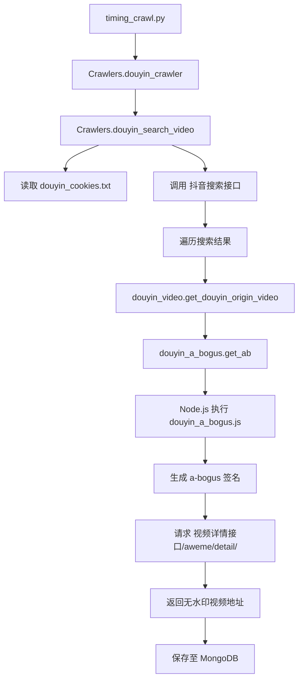

# 软件工程 analysis 文档

本项目是一个基于 Python 的多平台（TikTok、YouTube、抖音）视频抓取与搬运系统。它集成了视频爬虫、数据存储、Web 预览及视频发布功能。

## 1. 程序启动方式

本项目包含两个主要运行入口：爬虫调度器和 Web 服务服务器。

### 1.1 爬虫启动方式
爬虫通过 `timing_crawl.py` 启动，负责定时从各个平台抓取视频数据并存入 MongoDB。

- **本地测试运行：**
  ```bash
  python3 -u timing_crawl.py test
  ```
- **服务器部署运行：**
  ```bash
  python3 -u timing_crawl.py server
  ```
- **工作原理：** 该脚本读取 `config.ini` 中的 `Crawlers` 配置，实例化 `crawlers.py` 中的 `Crawlers` 类，并依次调用各平台的抓取方法。

### 1.2 Web 服务启动方式
Web 服务通过 `run_server.py` 启动，基于 Flask 框架，提供视频列表展示、下载及搬运功能。

- **启动命令：**
  ```bash
  python3 -u run_server.py [test]
  ```
- **工作原理：** 启动一个 Flask Web 服务器（默认端口 5050），连接 MongoDB 读取视频数据，并提供前端展示页面。

---

## 2. 各平台数据抓取入口

所有平台的抓取逻辑核心均位于 `crawlers.py` 文件中的 `Crawlers` 类。

- **TikTok 抓取入口：** `Crawlers.tiktok_crawler(keyword)`
  - **机制**：核心为 **API 请求**。通过 `requests` 直接调用 TikTok 内部接口或第三方代理接口。
  - **浏览器使用**：仅在 `update_tiktok_cookies` 中使用 `undetected_chromedriver` 模拟浏览器以刷新 Cookie。
- **YouTube 抓取入口：** `Crawlers.youtube_crawler(keyword)`
  - **机制**：**API 请求与 HTML 解析**。通过 `requests` 访问 YouTube 的 `youtubei` 接口进行搜索，并解析视频详情页中的 `ytInitialPlayerResponse` JSON 数据。
  - **浏览器使用**：采集阶段无需模拟浏览器。
- **抖音 抓取入口：** `Crawlers.douyin_crawler(keyword)`
  - **机制**：**API 请求 + 脚本执行**。利用生成的 `a-bogus` 签名，通过 `requests` 调用详情接口。详见下文抓取逻辑。
  - **浏览器使用**：采集阶段通过 Node.js 执行 JS 脚本生成签名，而非全量浏览器渲染。

---

## 3. 抖音平台抓取机制详析

抖音平台的抓取是本项目的核心难点，涉及签名加密（a-bogus）和无水印提取。

### 3.1 抓取流程图


### 3.2 关键组件说明
- **`douyin_cookies.txt`**：必须手动更新的 Cookie 文件，用于过搜索接口的检测。
- **`douyin_a_bogus.js`**：核心加密逻辑（JavaScript），用于生成抖音 API 所需的 `a-bogus` 签名。
- **`douyin_a_bogus.py`**：Python 包装器，通过 `subprocess` 调用 Node.js 运行上述 JS 文件。
- **`douyin_video.py`**：封装了 `get_douyin_origin_video` 函数，负责拼接带有签名的详情请求 URL 并解析出原始视频链接。

### 3.3 无水印提取原理
本项目通过模拟 Web 端请求，利用生成的 `a-bogus` 签名访问 `/aweme/v1/web/aweme/detail/` 接口。该接口返回的 `play_addr` 列表中包含了 CDN 的原始视频地址，从而实现无水印提取。

---

## 4. 视频发布机制 (Publishing)

与视频抓取不同，**视频发布（搬运）功能完全依赖于浏览器模拟**。

- **核心工具**：使用 `Selenium` 和 `undetected-chromedriver`。
- **工作机制**：
  1. **初始化**：脚本启动一个带有特定配置的 Chrome 浏览器实例（由 `login.py` 控制）。
  2. **登录**：
     - **抖音**：通过展示二维码让用户扫码登录。
     - **TikTok/YouTube**：通过模拟输入账号密码进行登录。
  3. **自动化操作**：
     - 导航至平台的上传页面（如 `creator.douyin.com/creator-micro/content/upload`）。
     - 通过 `send_keys` 将本地视频文件路径传给上传控件。
     - 使用 XPath 定位并填充视频标题、标签等元数据。
     - 模拟点击“发布”按钮。
  4. **异常处理**：遇到验证码（如 hcaptcha）时，会提示用户处理。

---

## 5. 高级分析模块 (Advanced Filtering)

本项目新增了一个完全独立的高级筛选模块 `douyin_advanced_crawler.py`。

### 5.1 模块特性
- **完全解耦**：作为一个独立的 Python 文件，不修改原有代码库。
- **配置驱动**：通过 `config.ini` 中的 `[Douyin_Advanced]` 和 `[MySQL]` 段进行控制。
- **独立存储**：与原有的 MongoDB 存储分离，高级模块使用 **MySQL** 数据库进行结构化存储，便于深度分析。
- **互动价值模型**：实现了基于粉丝数、播放量、点赞、评论等维度的深度筛选。

### 5.2 核心指标计算
- **互动率 (Engagement Rate)**：`(点赞 + 评论 + 收藏 + 分享) / 播放量`。
- **粉丝/播放比 (Fan-to-View Ratio)**：`播放量 / 粉丝数`。反映了视频在粉丝圈层外的“破圈”能力。
- **粉丝上限过滤**：自动过滤粉丝数超过阈值（如 50万）的 UP 主，聚焦于长尾高增长账号。
